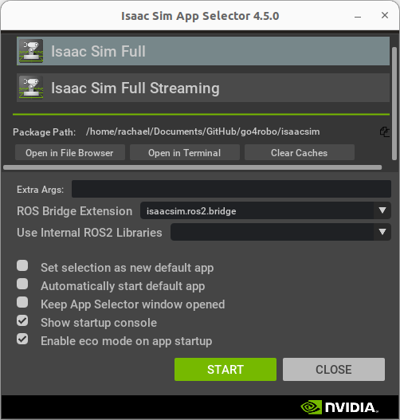
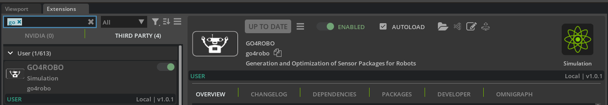

# GO4ROBO

Work for my MITsdm Masters' Thesis.

## Notes to Self

### how to friggin ray cast

value = collisions_utils.ray_cast(position=position, orientation=orientation, offset=offset)

## Project Setup

For this project, you'll need:

- [Ubuntu 22.04](https://releases.ubuntu.com/jammy/) (for compatibility with Isaac Sim)
- [Isaac Sim 4.5.0](https://docs.isaacsim.omniverse.nvidia.com/latest/index.html) [(Minimum Requirements)](https://docs.isaacsim.omniverse.nvidia.com/latest/installation/requirements.html)
- [ROS2 Humble](https://docs.ros.org/en/humble/index.html)
- [Python 3.10](https://www.python.org/downloads/release/python-3100/)

### ROS2 HUMBLE

Isaac Sim needs ROS2 Humble. [Install ROS2 Humble](https://docs.ros.org/en/humble/Installation/Ubuntu-Install-Debs.html).

*Hint: Add `source /opt/ros/humble/setup.bash` to your `~/.bashrc` file for convenience!*

### Isaac Sim

[Install Isaac Sim](https://docs.isaacsim.omniverse.nvidia.com/latest/installation/install_workstation.html#workstation-setup) **BUT** rather than unzipping it to `~/isaacsim`, unzip it to the `./isaacsim` directory in this repo. *This is so that we can [develop Isaac Sim extensions in VSCode](https://isaac-sim.github.io/IsaacLab/main/source/overview/developer-guide/vs_code.html)!*

1. Download [Isaac Sim Version 4.5.0](https://docs.isaacsim.omniverse.nvidia.com/latest/installation/download.html#isaac-sim-latest-release) (the commands below assume it goes to `~/Downloads`)
2. In terminal, `cd` to this repo's main directory, for me that is `cd ~/Documents/Github/go4robo`, you may have put it elsewhere.
3. Unzip the downloaded content to this repo's `isaacsim` directory: `unzip "~/Downloads/isaac-sim-standalone@4.5.0-rc.36+release.19112.f59b3005.gl.linux-x86_64.release.zip" -d ./isaacsim`
4. *Note: the GO4R extension is already included in `./isaacsim/extUser/go4robo`. The unzip should handle this, but it's probably worth making sue that it is still there after the unzip.*
5. In a terminal, navigate to `./isaacsim`
6. Run `./post_install.sh`
7. Run `./isaac-sim.selector.sh`, and set it up with the ROS2 bridge and the default ROS2 Humble workspace, as shown.

After you run the selector once, you can select the "defualt app" setting, and thereafter you can run isaacsim using the command `./isaac-sim.sh` (from within the `isaacsim` directory).

### VSCode with Isaac Sim

You obviously need VSCode for this part, so download that and get it working. Make sure that you can launch it from Terminal using `code`, otherwise Isaac Sim will complain.

Then in **VSCode**:

1. Launch VS Code Quick Open (`Ctrl+P`)
2. Install the Isaac Sim extension with `ext install NVIDIA.isaacsim-vscode-edition`

This extension (more information [here](https://marketplace.visualstudio.com/items?itemName=NVIDIA.isaacsim-vscode-edition)) is helpful for grabbing snippets of code, debugging, and more!

Finally, in **Isaac Sim**:

1. Go to `Window > Extensions` to bring up the Extensions window
2. Type "VS" in the search bar and click into the `THIRD PARTY` section
3. Enable the `VS CODE INTEGRATION` Extension (`isaacsim.code_editor.vscode" = { version = "1.0.5" }`). Setting it to "AUTOLOAD" is also a good idea.
4. Enable the `VSCODE KIT DEBUGGER` Extension (`"isaacsim.code_editor.vscode" = { version = "1.0.5" }`). Setting it to "AUTOLOAD" is also a good idea.

Note that this repo comes with the `.vscode` files configured so that you can immediately start working with Isaac Sim. To be able to set break points and otherwise easily introspect:

1. Open the debugging tab on the left side bar in VSCode
2. Use the dropdown to select the debugger labelled `Python: Attach (windows-x86/linux-x86_64)`
3. Open `isaac_sim/extUser/go4robo/go4robo/go4robo_python/extension.py`
4. Push the little green play button to start the debugger
5. In Isaac Sim's `VSCode Link` extension windo, hit `Refresh`

The text should show `VSCode Debugger Attached` in turquoise. You are now all set to start debugging the extension!

### Finally! The GO4R Isaac Sim Extension!

If you did all of the above correctly (especially the Isaac Sim install) correctly, you should be able to install the GO4R extension in **Isaac Sim**:

1. Go to `Window > Extensions` to bring up the Extensions window
2. Type "GO4R" in the search bar and click into the `THIRD PARTY` section
3. Enable the `GO4ROBO` Extension (`"go4robo" = { version = "1.0.1" }`). Setting it to "AUTOLOAD" is also a good idea.

*Hint: For a shortcut to edit the extension in VSCode, click the tiny VSCode icon in the upper right corner of the extension page.

## Archive Project Setup

Note that Python versions for the Conda env, Blender, and ROS2 might not match!

### Conda Environment

[Install Conda locally](https://docs.conda.io/projects/conda/en/latest/user-guide/install/index.html), navigate to this directory, and run:

`conda env create --name blenv --file conda_env.yml`

_Note to self: to export the conda environment, activate it and then run: `conda env export --file conda_env.yml --no-builds`_

### Blender

Install [Blender (Version 4.3.2) via the website](https://www.blender.org/download/).

Then point Blender to the Conda Environment using these steps:
    1. In Blender’s installation folder, rename the “python” directory (e.g., to “python_backup”).
    2. Navigate to Blender’s installation folder and link the Conda environment to "python". On Linux/Mac the command is: `ln -s python /Users/robosquiggles/miniforge3/envs/blenv`

### ROS2 Jazzy

Install [ROS2 Jazzy](https://docs.ros.org/en/jazzy/Installation/Ubuntu-Install-Debs.html). Be careful here becuase

### VSCode

I followed [this YouTube tutorial by CG Python](https://www.youtube.com/watch?v=_0srGXAzBZE) to get VSCode set up with Blender.
